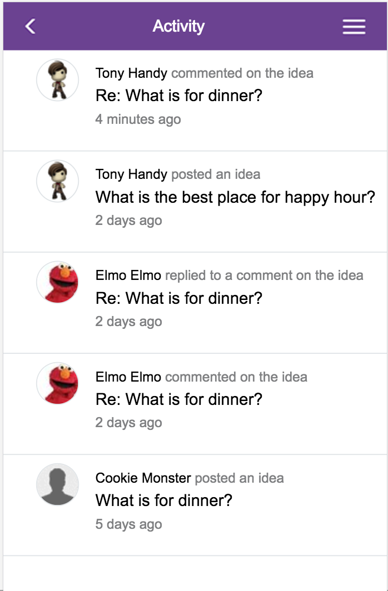

# Code Challenge

### For this Single Page Web App I used the following technologies to generate a given wireframe.

- React/Redux
- Express
- Webpack
- Sass 
- Babel

#### To run:

- run node server.js in /backend
- run webpack --watch in root
- run sass --watch ./frontend/scss/entry.scss:./frontend/bundle.css in root

# Wireframe

#### Extra Info

- project was built using Chrome Developer tools using the iPhone 6 View